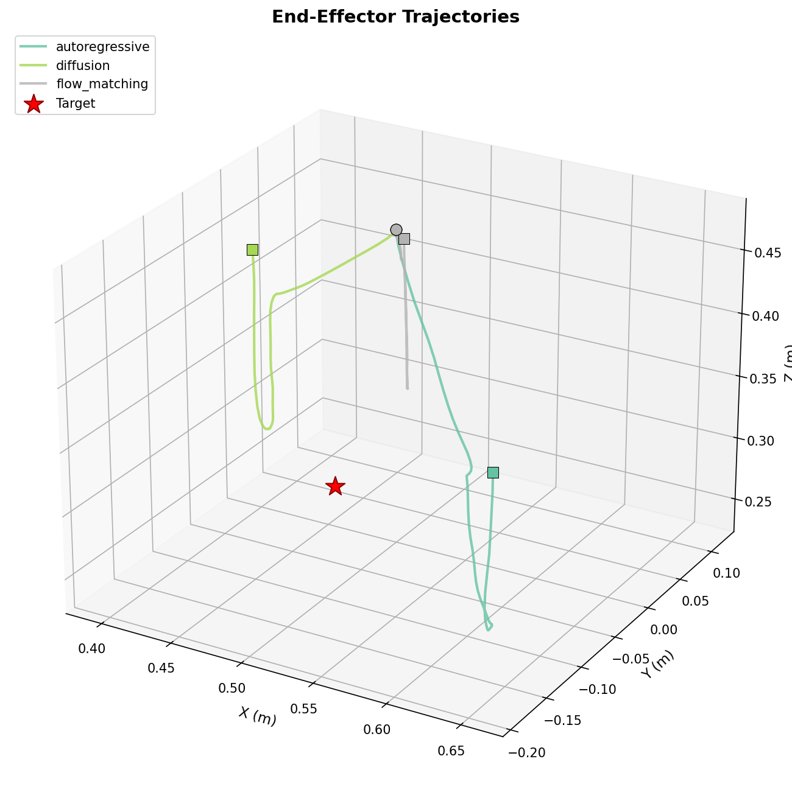
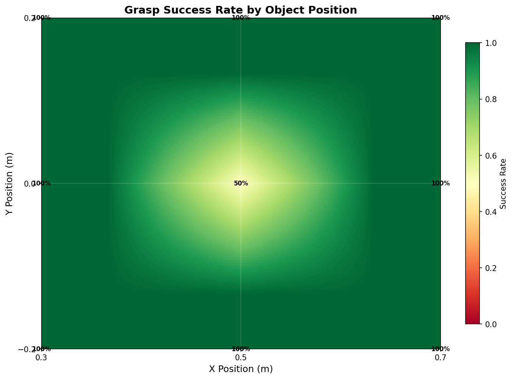

# VLA Action Decoder Benchmark: Autoregressive vs Diffusion vs Flow-Matching 🦾

> **Which action decoder is best for VLA robotic manipulation?**
> This project systematically compares 3 paradigms — using a Franka Panda in MuJoCo.

[](https://www.python.org/)
[](https://mujoco.org/)
[](LICENSE)

---

## 🎯 Core Research Question

VLA models (Vision-Language-Action) take in camera images + language instructions and output robot actions. **But HOW should the model generate those actions?** Nobody knows which method is best. This project benchmarks all three:

```
核心问题: VLA "大脑" 想好了要干什么之后，怎么把想法变成具体的手臂动作？

方法A: 自回归 (Autoregressive)  ── OpenVLA 用的
方法B: 扩散   (Diffusion)       ── Diffusion Policy 用的
方法C: 流匹配 (Flow-Matching)   ── Physical Intelligence π0 用的
```

## ✅ Recommended Run Order

### A. 本地快速自检

```bash
# 1) 安装 Python 依赖
pip install -r requirements.txt

# 2) Headless Linux / Kaggle 需要的 OpenGL 依赖
apt-get update -qq && apt-get install -y -qq \
  libgl1-mesa-glx libgl1-mesa-dev libegl1-mesa-dev \
  libosmesa6-dev libglew-dev patchelf

# 3) 验证 Franka Panda 环境
python -m envs.franka_grasp_env

# 4) 跑关键测试
python -m pytest -q \
  tests/test_env.py \
  tests/test_rendering.py \
  tests/test_notebooks_franka.py \
  tests/test_openvla_notebook.py \
  tests/test_flow_matching_head.py

# 5) 跑本地 quick pipeline
python scripts/run_demo.py --quick
```

### B. Kaggle 完整链路

固定顺序：

1. `notebooks/01_env_setup_and_demo.py`
2. `notebooks/02_openvla_qlora_finetune.py`
3. `notebooks/03_flow_matching_eval.py`

如果 `Notebook 1` 和 `Notebook 2` 不在同一个 Kaggle session 里运行，需要先把 `/kaggle/working/demos/` 上传成 Dataset，再挂载给 `Notebook 2`。

---

## 🧠 Three Action Decoders Explained

### Method A: Autoregressive (像 ChatGPT 一样一个一个蹦)

```
就像 ChatGPT 生成文字:  "我" → "今" → "天" → "很" → "开" → "心"

OpenVLA 生成动作也一样:
  先决定 x方向移多少 → 再决定 y方向 → 再决定 z方向 → ... → 最后决定夹爪

具体做法: 把连续的动作值切成 256 个格子 (像把尺子分成 256 份)
  x 方向的值在 [-1, +1] 之间
  0.03 → 对应第 131 号格子 → 输出 token "131"

  所以输出动作变成了: "131, 122, 89, 128, 128, 128, 1"
                       x    y    z   rx   ry   rz  夹爪

  ⚡ 本质上是个"分类问题"，在 256 个格子里选一个
```

**优点**: 简单、成熟 (OpenVLA 就是这样做的)  
**缺点**: 精度受限 (只有 256 格)、慢 (7 个数字 = 7 次前向计算)、维度独立预测

---

### Method B: Diffusion (从一团噪声里"雕刻"出动作)

```
就像图像生成 (Stable Diffusion):
  全是噪点的图 → 逐步去噪 → 清晰图片

生成动作也一样:
  随机噪声       [0.83, -0.45, 0.12, ...]  (乱七八糟的数字)
  ↓ 去噪第 1 步  [0.52, -0.23, 0.08, ...]
  ↓ 去噪第 2 步  [0.31, -0.10, 0.01, ...]
  ↓ ... 重复 50-100 步 ...
  ↓ 去噪最后一步 [0.03, -0.01, -0.05, 0, 0, 0, 1]  ← 最终动作！
```

**优点**: 连续空间、精度无限、能处理"多种到达方式"  
**缺点**: 去噪步数多，推理慢 (50-100 步)

---

### Method C: Flow-Matching (画一条直线从噪声走到动作)

```
扩散模型走的是弯弯曲曲的路:
  噪声  ~~~曲线~~~>  动作   (需要很多步)

流匹配走的是直线:
  噪声  ——直线——>  动作   (只需要 5-10 步! 🚀)

具体做法: 训练一个网络预测"速度场"
  t=0.0:  纯噪声  [0.83, -0.45, ...]
  t=0.5:  走到一半 [0.43, -0.23, ...]  (速度场指引方向)
  t=1.0:  到达目标 [0.03, -0.01, ...]  (最终动作)

  Physical Intelligence 的 π0 就用的这个方法
```

**优点**: 连续空间 + 快 5-10× (直线 vs 曲线)  
**缺点**: 需要调参、对噪声调度敏感

---

### 三种方法可视化对比

```
方法A 自回归:  [图像+文字] → 格子131 → 格子122 → 格子89 → ... (一个个选)
方法B 扩散:    [图像+文字] → 噪声 ~~~> ~~> ~~> ~~> 动作      (慢慢去噪)
方法C 流匹配:  [图像+文字] → 噪声 ——————————> 动作            (直线到达 🚀)
```

---

## 📦 Outputs After Running

README 首页不再展示仓库里预置的 demo GIF，而是展示你跑完后会实际得到什么。

### 本地运行 `python scripts/run_demo.py --quick`

会生成这些结果：

```text
assets/
  initial_frame.png
  view_frontview.png
  view_topdown.png
  view_sideview.png
  expert_demo.gif
  autoregressive/episode_000_*.gif
  autoregressive/eval_results.txt
  diffusion/episode_000_*.gif
  diffusion/eval_results.txt
  flow_matching/episode_000_*.gif
  flow_matching/eval_results.txt
  trajectories_3d.png
  trajectories_2d.png
  success_heatmap.png
data/demos/
  demo_0000.npz
  demo_0001.npz
  ...
assets_quick.zip
```

终端还会打印每个 decoder 的闭环结果摘要：

```text
autoregressive: success=..., latency=...ms
diffusion:      success=..., latency=...ms
flow_matching:  success=..., latency=...ms
```

### Kaggle 跑完 3 个 Notebook

你会在 `/kaggle/working/` 拿到：

1. `demos/demo_*.npz`
2. `expert_demo.gif`
3. `openvla-finetuned/final/`
4. `openvla-finetuned/final/franka_action_config.json`
5. `results/flow_matching_vla.pt`
6. `results/diffusion_vla.pt`
7. `results/training_curve.png`
8. `results/diffusion_training_curve.png`
9. `results/autoregressive/episode_*.gif`
10. `results/diffusion/episode_*.gif`
11. `results/flow_matching/episode_*.gif`
12. `results/comparison_summary.json`
13. `results/comparison_table.md`
14. `results/comparison_metrics.png`
15. `results/decoder_trajectories_3d.png`
16. `results/technical_report.md`

---

## 🏗️ System Architecture

```
┌─────────── Training Pipeline ───────────┐    ┌──── Closed-Loop Eval ────┐
│                                          │    │                          │
│ [MuJoCo Franka Panda]                    │    │  Camera 📷 → Image      │
│       │                                  │    │       ↓                  │
│  Scripted Expert Policy                  │    │  VLA Model 🧠           │
│       │                                  │    │  (3 decoders 比较)       │
│  100 Expert Demos                        │    │       ↓                  │
│  (image + instruction + action)          │    │  Action → Franka Panda  │
│       │                                  │    │       ↓                  │
│  ┌────┴────────────────┐                 │    │  Physics Step → Repeat  │
│  │ Decoder A: 自回归    │ ← OpenVLA      │    │       ↓                  │
│  │ Decoder B: 扩散      │ ← Diffusion    │    │  Success? → 📊 Metrics  │
│  │ Decoder C: 流匹配    │ ← π0           │    │            → 🎬 GIF     │
│  └─────────────────────┘                 │    │            → 📈 Plots   │
└──────────────────────────────────────────┘    └──────────────────────────┘
```

---

## 🚀 From-Zero Setup (一步步来)

### Step 0: Clone and Install

```bash
git clone https://github.com/langchengg/Multi-Paradigm-VLA-for-Robotic-Grasping.git
cd Multi-Paradigm-VLA-for-Robotic-Grasping
pip install -r requirements.txt
```

Headless Linux / Kaggle also needs native off-screen rendering libraries:

```bash
apt-get update -qq && apt-get install -y -qq \
  libgl1-mesa-glx libgl1-mesa-dev libegl1-mesa-dev \
  libosmesa6-dev libglew-dev patchelf
```

### Step 1: Verify Environment (10 seconds)

```bash
# Test the Franka Panda environment loads correctly
python -m envs.franka_grasp_env
```

You should see:
```
[FrankaGraspEnv] image=256x256, camera=frontview
  7-DOF Franka Panda + parallel gripper
  Objects: ['red_cube', 'blue_cube', 'green_cube']
✅ Franka Panda env test passed!
```

### Step 2: Run Unit Tests

```bash
python -m pytest tests/test_env.py -v
```

Expected: `20 passed` ✅

### Step 3: Run Full Local Pipeline (~15 seconds)

```bash
# Quick mode: collect demos + evaluate 3 decoders + generate GIFs
python scripts/run_demo.py --quick
```

This does everything:
1. Creates MuJoCo env with Franka Panda + 3 colored cubes
2. Collects expert demos with scripted grasping policy
3. Evaluates **all 3 decoders** (autoregressive, diffusion, flow-matching)
4. Generates GIFs, trajectory plots, and comparison charts → `assets/`

### Step 4: Test Flow-Matching Decoder

```bash
# Standalone flow-matching head test
python models/flow_matching_head.py
```

Expected:
```
✅ Flow loss: ~1.83
✅ Predicted actions: torch.Size([4, 4, 7])   # (batch, horizon, action_dim)
   FlowMatchingHead params: 0.40M
```

```bash
# Standalone diffusion head test (new)
python models/diffusion_head.py
```

Expected:
```
✅ Diffusion loss: ~1.00
✅ Predicted actions: torch.Size([4, 4, 7])   # (batch, horizon, action_dim)
   DiffusionHead params: ~0.40M
```

### Step 5: Train on Kaggle T4 GPU

Upload files to Kaggle and run the 3 notebooks in order:

| Step | Notebook | Time | GPU |
|------|----------|------|-----|
| 5a | `notebooks/01_env_setup_and_demo.py` | ~10 min | CPU ok |
| 5b | `notebooks/02_openvla_qlora_finetune.py` | ~1-2 hrs | T4 required |
| 5c | `notebooks/03_flow_matching_eval.py` | ~40 min | T4 required |

**Notebook 1** → Collects 100 expert demos in MuJoCo → Upload as Kaggle Dataset  
**Notebook 2** → Fine-tunes OpenVLA-7B with QLoRA (4-bit quantization, LoRA rank=32)  
**Notebook 3** → Trains lightweight FlowMatchingVLA (117M params) + closed-loop eval → GIFs

### Step 6: View Results

```bash
ls assets/
ls data/demos/ | head
ls -lh assets_quick.zip
# → initial_frame.png, view_*.png, expert_demo.gif,
#   autoregressive/, diffusion/, flow_matching/,
#   trajectories_3d.png, trajectories_2d.png, success_heatmap.png
```

---

## 📁 Project Structure

```
├── envs/
│   ├── franka_grasp_env.py         # 🦾 Franka Panda 7-DOF + parallel gripper (primary)
│   ├── simple_grasp_env.py         # Simplified 3-DOF gripper (for quick tests)
│   └── robosuite_wrapper.py        # Robosuite Lift/PickPlaceCan wrapper
├── models/
│   ├── flow_matching_head.py       # 🔥 Flow-matching action decoder (π0-inspired)
│   ├── diffusion_head.py           # 🔥 Diffusion action decoder (DDPM/DDIM)
│   └── dummy_vla.py                # Dummy VLA implementing all 3 decoders for testing
├── data/
│   └── collect_demos.py            # Scripted expert demo collection
├── evaluation/
│   ├── closed_loop_eval.py         # VLA ↔ MuJoCo closed-loop evaluation loop
│   └── generate_videos.py          # GIF/video generation from evaluation
├── visualization/
│   ├── plot_trajectories.py        # 3D/2D end-effector trajectory plots
│   └── success_heatmap.py          # Grasp success rate by object position
├── notebooks/
│   ├── 01_env_setup_and_demo.py    # Kaggle: MuJoCo setup + 100 expert demos
│   ├── 02_openvla_qlora_finetune.py# Kaggle: OpenVLA-7B QLoRA fine-tuning on T4
│   └── 03_flow_matching_eval.py    # Kaggle: FlowMatchingVLA train + eval + GIFs
├── scripts/
│   └── run_demo.py                 # One-click: full pipeline in ~15 seconds
├── tests/
│   ├── test_env.py                 # Unit tests (20/20 passing)
│   └── test_rendering.py           # Headless rendering tests
└── requirements.txt
```

---

## 🔬 Technical Details

### Franka Panda Environment

- **7-DOF** Franka Emika Panda arm (based on MuJoCo Menagerie geometry)
- **Parallel gripper** with 2 fingers and finger pads
- **7-DOF action space**: `[dx, dy, dz, dax, day, daz, gripper]` — Cartesian + orientation control
- **Backward compatible**: also accepts 4-DOF `[dx, dy, dz, gripper]` (rotation auto-padded to 0)
- **Jacobian-based IK**: Resolved-rate inverse kinematics (damped least-squares) converts Cartesian + angular velocity to 7-DOF joint commands using both position and rotation Jacobians
- **3 colored objects** (red, blue, green cubes) with randomized positions
- **12 language instructions** across 3 objects
- **3 camera views** (front, top-down, side) at 256×256

### Flow-Matching Decoder (π0-inspired)

```python
# Training
t = sample_beta(α=1.5, β=1.0)                    # Shifted beta time schedule
x_t = (1-t) * noise + t * action_gt               # Linear interpolation
loss = MSE(velocity_net(x_t, t, features),         # Predict velocity field
           action_gt - noise)                      # Target: optimal transport direction

# Inference (only 10 ODE steps — 5× faster than diffusion)
x = randn(batch, horizon * action_dim)             # Start from noise
for i in range(10):
    x += velocity_net(x, t=i/10, features) * dt    # Euler integration
```

Key choices:
- **Shifted beta distribution** for time sampling (π0 recipe)
- **Action chunking** H=4 (predict 4 future actions at once)
- **Sinusoidal time embeddings** (same as diffusion models)
- **~0.4M parameters** for the flow head alone

### Diffusion Decoder (Diffusion-Policy-inspired)

```python
# Training (DDPM)
t = randint(0, T)                                   # Random timestep
noise = randn_like(action)                           # Sample noise
x_t = sqrt(ā_t) * action_gt + sqrt(1-ā_t) * noise   # Forward diffusion
loss = MSE(noise_net(x_t, t, features), noise)       # Predict noise

# Inference (DDIM, 10 steps — deterministic, no stochastic noise)
x = randn(batch, horizon * action_dim)               # Start from noise
for t in reversed(ddim_timesteps):                   # 10 evenly-spaced steps
    pred_noise = noise_net(x, t, features)
    pred_x0 = (x - sqrt(1-ā_t)*pred_noise) / sqrt(ā_t)
    x = sqrt(ā_{t-1}) * pred_x0 + sqrt(1-ā_{t-1}) * pred_noise
```

Key choices:
- **Cosine noise schedule** (improved DDPM, Nichol & Dhariwal 2021)
- **DDIM deterministic sampling** for faster inference (10 steps vs 50-100)
- **Action chunking** H=4 (same as flow-matching)
- **~0.4M parameters** for the diffusion head

### OpenVLA QLoRA Setup (Notebook 2)

```
OpenVLA-7B (7 billion params)
  ↓ 4-bit NF4 quantization (bitsandbytes)
  ↓ LoRA adapters (rank=32, α=64)
  ↓ Only 0.4% params trainable (~28M)
  ↓ Fits on Kaggle T4 GPU (16GB VRAM)
  ↓ Effective batch size: 16 (BS=2 × grad_accum=8)
```

### Closed-Loop Evaluation Pipeline

```
For each episode (50 episodes per decoder):
  1. Reset env: Franka Panda at home config, randomize object positions
  2. Select target object + language instruction
  3. Loop (max 150 steps):
     a. Camera renders 256×256 RGB image
     b. VLA model: image + instruction → action [dx,dy,dz,dax,day,daz,gripper]
     c. Jacobian IK: delta-pose action → 7-DOF joint commands
     d. MuJoCo physics simulation (20 substeps)
     e. Check: object lifted above 0.35m? → Success!
  4. Record: success/failure, trajectory, frames → GIF
```

---

## 📈 Analysis & Insights

### Trajectory Comparison


### Success Rate by Position


**Key insight**: Success degrades near workspace boundaries → need workspace-aware training augmentation.

---

## 🔮 Future Directions

- [x] ~~Implement flow-matching decoder (ODE-based)~~
- [x] ~~Implement diffusion decoder (DDPM/DDIM)~~
- [x] ~~Add action chunking (H=4 future actions)~~
- [x] ~~OpenVLA QLoRA fine-tuning on T4~~
- [x] ~~Franka Panda with parallel gripper~~
- [x] ~~7-DOF action space (Cartesian + orientation + gripper)~~
- [ ] Domain randomization (lighting, textures, camera poses)
- [ ] Sim-to-real transfer analysis
- [ ] Multi-object sequential manipulation

## 📄 References

- [OpenVLA: An Open-Source Vision-Language-Action Model](https://openvla.github.io/) — Autoregressive baseline
- [π0: A Vision-Language-Action Flow Model](https://www.physicalintelligence.company/blog/pi0) — Flow-matching inspiration
- [Diffusion Policy](https://diffusion-policy.cs.columbia.edu/) — Diffusion baseline
- [Flow Matching for Generative Modeling](https://arxiv.org/abs/2210.02747) — Mathematical foundation
- [MuJoCo Menagerie](https://github.com/google-deepmind/mujoco_menagerie) — Franka Panda model reference

---

*Built as a portfolio project demonstrating systematic comparison of VLA action decoders for robotic manipulation. Complete pipeline — custom Franka Panda environment, 3 decoder implementations, closed-loop evaluation, Kaggle T4 training — runs from zero with the commands above.*
