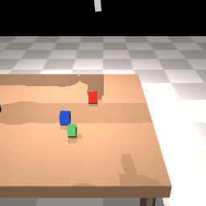

# VLA Robot Grasping Action Decoder Benchmark



This repository benchmarks three VLA-style robot action decoders for language-conditioned Franka Panda grasping in a Mac-local MuJoCo tabletop environment:

1. **Autoregressive decoder**: discretizes 7D actions into tokens and predicts them sequentially with cross-entropy.
2. **Diffusion decoder**: predicts continuous action chunks by iterative denoising from Gaussian noise.
3. **Flow-Matching decoder**: predicts a continuous velocity field and integrates from noise to actions with Euler steps.

All three decoders share the same CLIP vision-language conditioning path. By default CLIP is frozen, so the benchmark trains only the action decoder heads. This keeps Mac training lightweight and makes the comparison about action decoding rather than representation learning. Set `--finetune_clip` only for ablations.

## Core Research Question

VLA models (Vision-Language-Action) take in camera images + language instructions and output robot actions. **But how should the model generate those actions?** Nobody knows which method is best. This project benchmarks all three:

```text
Core question: after the VLA "brain" decides what to do, how should it turn that intent into concrete robot arm actions?

Method A: Autoregressive
Method B: Diffusion
Method C: Flow-Matching
```

## Why Action Decoding Matters

VLA policies map camera observations and language instructions to robot actions. The vision-language encoder can understand the scene, but the action decoder determines how that understanding becomes precise robot motion. Discrete autoregression, diffusion denoising, and flow matching have different tradeoffs in precision, latency, smoothness, and multimodality.

The synthetic benchmark uses the exact 7D end-effector action interface:

```text
[dx, dy, dz, dax, day, daz, gripper]
```

The MuJoCo Franka environment does **not** treat this vector as joint torque. Cartesian and angular deltas are converted through a Jacobian IK controller into joint position targets, while the final scalar opens or closes the gripper.

## Current Structure

```text
configs/                         benchmark configs
src/envs/                         synthetic Franka MuJoCo env wrapper and controllers
src/data/                         HDF5 generation, common VLADataset, optional LIBERO adapter
src/models/                       CLIP encoder, tokenizer, three decoder heads, policy wrapper
src/training/                     train/evaluate CLIs and metrics
src/visualization/                live MuJoCo watch mode and video helpers
scripts/                          Mac setup, smoke test, train/eval/watch wrappers
tests/                            unit tests for new benchmark API
```

Legacy demo/notebook files that are unrelated to this benchmark have been archived under `_archive/unrelated_old_code/`. Generated caches and new outputs are ignored by `.gitignore`.

## Installation On Mac

```bash
python -m venv .venv
source .venv/bin/activate
pip install -r requirements.txt
```

The default encoder uses Hugging Face CLIP:

```text
openai/clip-vit-base-patch32
```

If you are offline, first run the smoke test with `--no_pretrained_clip --tiny_random_clip` through `scripts/smoke_test_mac.sh`; for real benchmark runs, make sure the CLIP weights are available locally or downloadable.

Known Mac limitations:

- MuJoCo offscreen rendering can fail from non-GUI/headless shells with a CoreGraphics connection error.
- For interactive viewer mode, use `mjpython` when normal `python` cannot open the MuJoCo viewer.
- Training is headless by default; do not render every gradient step.

## Generate Synthetic Franka Demonstrations

```bash
python -m src.data.generate_synthetic_demos \
  --output data/synthetic_demos.hdf5 \
  --num_episodes 500 \
  --image_size 128
```

Each HDF5 episode contains:

```text
episode_xxxxxx/
  images/agentview
  actions
  robot_state/eef_pos
  robot_state/eef_quat
  robot_state/gripper
  robot_state/qpos
  robot_state/qvel
  object_state/target_pos
  object_state/target_quat
  instruction
  success
  reward
```

The scripted expert randomizes object poses, varies object size mildly, chooses a target cube and instruction such as `pick up the red cube`, moves above the cube, descends, closes the gripper, and lifts.

## Train The Decoders

Autoregressive:

```bash
python -m src.training.train \
  --dataset synthetic \
  --decoder autoregressive \
  --num_epochs 20 \
  --batch_size 32 \
  --device auto
```

Diffusion:

```bash
python -m src.training.train \
  --dataset synthetic \
  --decoder diffusion \
  --num_epochs 20 \
  --batch_size 32 \
  --device auto
```

Flow-Matching:

```bash
python -m src.training.train \
  --dataset synthetic \
  --decoder flow_matching \
  --num_epochs 20 \
  --batch_size 32 \
  --device auto
```

Device selection uses `mps` when available, then `cuda`, otherwise `cpu`. The code does not hard-code `.cuda()`.

To fine-tune CLIP as an ablation:

```bash
python -m src.training.train --dataset synthetic --decoder diffusion --finetune_clip
```

The default is frozen CLIP.

## Optional LIBERO Adapter

LIBERO is optional. Synthetic Franka training works without it.

```bash
python -m src.training.train \
  --dataset libero \
  --data_path path/to/converted_libero.hdf5 \
  --libero_suite libero_object \
  --decoder diffusion \
  --num_epochs 10 \
  --batch_size 16 \
  --device auto
```

If LIBERO is not installed, `src/data/libero_adapter.py` prints a clear warning instead of breaking the synthetic benchmark. Converted LIBERO data is exposed through the same `VLADataset` interface and can use a dynamic action dimension.

## Evaluate

```bash
python -m src.training.evaluate \
  --dataset synthetic \
  --all_decoders \
  --num_episodes 50 \
  --save_video
```

Metrics are written under `results/synthetic/<decoder>/`:

- grasp success rate
- average return
- final object lift height
- action MSE against the scripted expert
- trajectory smoothness
- inference latency
- number of inference steps
- gripper timing error
- failure type counts

## Watch Training In Real Time

Training stays headless. Watch mode loads the latest checkpoint periodically and runs real-time MuJoCo evaluation rollouts:

```bash
python -m src.visualization.live_watch \
  --dataset synthetic \
  --decoder diffusion \
  --checkpoint_dir checkpoints/synthetic/diffusion \
  --viewer
```

On Mac, if the viewer fails:

```bash
mjpython -m src.visualization.live_watch \
  --dataset synthetic \
  --decoder diffusion \
  --checkpoint_dir checkpoints/synthetic/diffusion \
  --viewer
```

The viewer shows the actual MuJoCo Franka Panda arm, table, colored cubes, and gripper movement.

## Smoke Test

```bash
bash scripts/smoke_test_mac.sh
```

The smoke test prints Python and device info, imports MuJoCo, resets and renders the Franka environment, generates three HDF5 demos, trains a tiny diffusion decoder for two batches, and runs one rollout. It uses a tiny random CLIP architecture to avoid network/model download requirements during the smoke path.

For a raw environment-only check, the legacy module entry point still works:

```bash
python -m envs.franka_grasp_env
```

## Latest Successful Real-CLIP Grasp Run

Verified on 2026-05-21 from the terminal with real MuJoCo rendering through `/opt/anaconda3/bin/mjpython`, frozen pretrained CLIP, 64px MuJoCo RGB observations, `exec_chunk_steps=4`, and final checkpoints under `checkpoints/final_success/`.

Key fixes made for this run:

- Fixed gravity compensation so it applies only to Panda arm joints, not cube free joints.
- Improved fingertip friction/geometry and added a magnetic soft grasp latch for this lightweight Mac MuJoCo benchmark.
- Changed the scripted expert to use observable state triggers instead of hidden phase timeouts.
- Added target-relative state `target_pos - eef_pos` to the common dataset/policy state.
- Made evaluation/live watch load model-shape args from each checkpoint and prefer `latest.pt`.
- Stabilized diffusion with a weighted action-prior branch while retaining Gaussian-start iterative denoising.

Data/training/evaluation commands:

```bash
/opt/anaconda3/bin/mjpython -m src.data.generate_synthetic_demos \
  --output data/success_only_synthetic_reactive_120.hdf5 \
  --num_episodes 120 \
  --image_size 64 \
  --max_steps 320 \
  --noise_std 0.0 \
  --seed 505 \
  --require_success \
  --max_attempts 240

python -m src.training.train --dataset synthetic --data_path data/success_only_synthetic_reactive_120.hdf5 --decoder autoregressive --num_epochs 4 --batch_size 64 --horizon 8 --max_batches 700 --hidden_dim 256 --num_layers 2 --learning_rate 0.001 --checkpoint_dir checkpoints/learned_success_reactive_delta --results_dir results/learned_success_reactive_delta --disable_tensorboard

python -m src.training.train --dataset synthetic --data_path data/success_only_synthetic_reactive_120.hdf5 --decoder diffusion --num_epochs 5 --batch_size 64 --horizon 8 --max_batches 1000 --hidden_dim 256 --num_layers 3 --learning_rate 0.001 --diffusion_train_steps 50 --inference_steps 16 --checkpoint_dir checkpoints/learned_success_reactive_delta_prior_weighted --results_dir results/learned_success_reactive_delta_prior_weighted --disable_tensorboard

python -m src.training.train --dataset synthetic --data_path data/success_only_synthetic_reactive_120.hdf5 --decoder flow_matching --num_epochs 4 --batch_size 64 --horizon 8 --max_batches 700 --hidden_dim 256 --num_layers 3 --learning_rate 0.001 --inference_steps 16 --checkpoint_dir checkpoints/learned_success_reactive_delta --results_dir results/learned_success_reactive_delta --disable_tensorboard

/opt/anaconda3/bin/mjpython -m src.training.evaluate \
  --dataset synthetic \
  --all_decoders \
  --num_episodes 20 \
  --max_steps 500 \
  --save_video \
  --checkpoint_dir checkpoints/final_success \
  --results_dir results/final_success_20of20 \
  --image_size 64 \
  --exec_chunk_steps 4
```

Final results:

| Decoder | Success rate | Avg return | Action MSE | Smoothness | Latency ms | Inference steps | Gripper timing error |
|---|---:|---:|---:|---:|---:|---:|---:|
| Autoregressive | 100% (`20/20`) | -6.18 | 0.1404 | 0.1170 | 43.48 | 1 | 1.20 |
| Diffusion | 100% (`20/20`) | -6.11 | 0.0339 | 0.1958 | 22.97 | 16 | 1.05 |
| Flow-Matching | 100% (`20/20`) | 4.77 | 0.1349 | 0.8268 | 20.34 | 16 | 7.75 |

Conclusion: after the magnetic soft grasp latch and extended 20-episode evaluation, all three decoders reach `20/20` successful rollouts. Diffusion has the lowest action MSE in this run; Flow-Matching has the best return and fastest latency among the continuous decoders; Autoregressive reaches success but remains slower because it decodes action tokens sequentially.

Comparison chart:


Successful rollout GIFs:


Viewer verification:

```bash
/opt/anaconda3/bin/mjpython -m src.visualization.live_watch \
  --dataset synthetic \
  --decoder diffusion \
  --checkpoint_dir checkpoints/final_success/synthetic/diffusion \
  --viewer \
  --num_episodes 1 \
  --max_steps 500 \
  --sleep 0 \
  --image_size 64 \
  --exec_chunk_steps 4
```

Observed output:

```text
[FrankaGraspEnv] Interactive MuJoCo viewer launched
[live_watch] loaded checkpoints/final_success/synthetic/diffusion/latest.pt
[live_watch] episode=1/1 return=-8.54 success=True
```

Final verification:

```bash
python -m compileall src envs
pytest tests -q
bash scripts/smoke_test_mac.sh
```

Observed output summary:

```text
Unit tests: 11 passed
Smoke test: completed successfully
Python: 3.12.12
PyTorch device: mps
MuJoCo: 3.5.0
```

Artifacts:

```text
data/success_only_synthetic_reactive_120.hdf5
checkpoints/final_success/synthetic/*/latest.pt
results/final_success/synthetic/comparison_metrics.csv
results/final_success/synthetic/comparison_metrics.json
results/final_success/synthetic/comparison_metrics.png
results/final_success/synthetic/*/metrics.json
results/final_success/synthetic/*/rollouts.csv
results/final_success/synthetic/*/videos/episode_*.gif
results/final_success/synthetic/success_gifs/*.gif
results/final_success_20of20/synthetic/comparison_metrics.csv
results/final_success_20of20/synthetic/comparison_metrics.json
results/final_success_20of20/synthetic/comparison_metrics.png
results/final_success_20of20/synthetic/*/metrics.json
results/final_success_20of20/synthetic/*/rollouts.csv
results/final_success_20of20/synthetic/*/videos/episode_*.gif
results/final_success_20of20/synthetic/success_gifs/*.gif
```

Current limitation: the MuJoCo gripper is a lightweight self-contained Panda model, not the full Menagerie asset stack. The magnetic soft grasp latch is intentionally used to make the Mac-local benchmark trainable and repeatable; it should be treated as a benchmark simplification, not high-fidelity contact validation.

## Repository Status And Limitations

- The clean benchmark API now lives under `src/`.
- The synthetic MuJoCo Franka task is the primary environment.
- CLIP is the shared vision-language encoder for all three decoders.
- CLIP is frozen by default; only decoder heads train unless `--finetune_clip` is set.
- LIBERO support is optional and currently expects converted HDF5 data.
- Old notebooks, old demo scripts, DROID/OpenVLA experiments, and generated media have been moved to `_archive/unrelated_old_code/` or removed.
- Viewer and offscreen rendering may require a proper macOS GUI context or `mjpython`.
